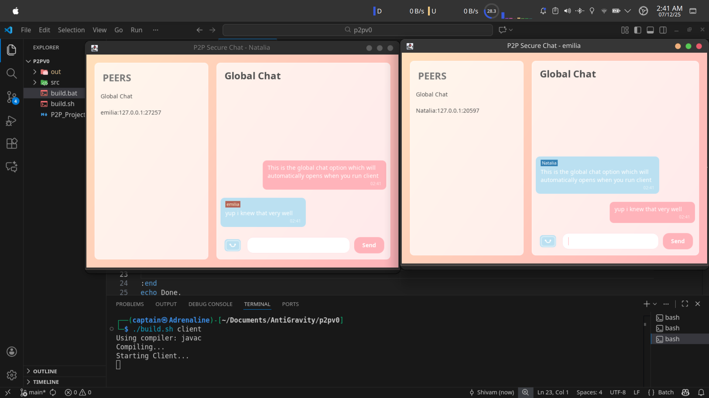
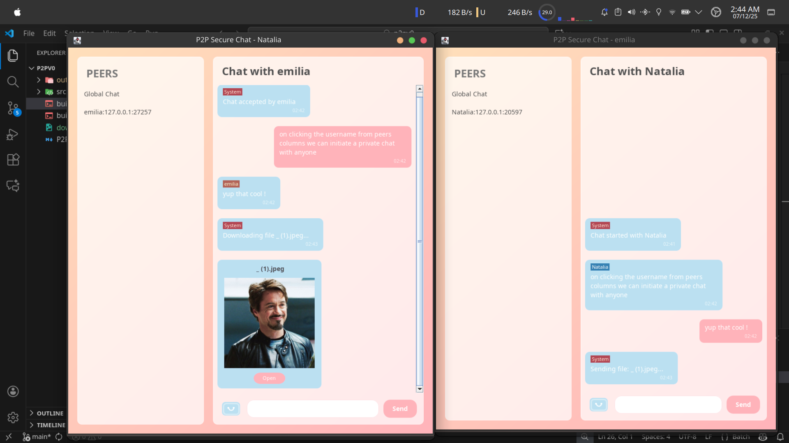

# P2P Secure Chat Application 🔐

A modern, privacy-focused Peer-to-Peer (P2P) secure messaging and file transfer application built in Java with end-to-end encryption.

## 📋 Table of Contents

- [Overview](#overview)
- [Features](#features)
- [Architecture](#architecture)
- [Security](#security)
- [Installation](#installation)
- [Usage](#usage)
- [Project Structure](#project-structure)
- [Technology Stack](#technology-stack)
- [Screenshots](#screenshots)
- [Contribution & Feedback](#contribution--feedback)
- [Gratitude](#gratitude)

---

## 🎯 Overview

P2P is a hybrid peer-to-peer communication system designed to provide secure, decentralized messaging without relying on centralized servers to store user data or messages. Unlike traditional messaging platforms (WhatsApp, Telegram) that maintain metadata and message logs on central servers, P2P facilitates direct encrypted connections between users while using a lightweight **Discovery Server** solely for peer lookups.

### Key Philosophy
- **Privacy First**: No central authority stores your conversations
- **User Control**: Direct peer-to-peer connections for all communications
- **Modern Design**: Beautiful glassmorphic UI built with Java Swing
- **Secure by Default**: End-to-end encryption on all messages and files

---

## ✨ Features

### 💬 Messaging
- **Real-time text messaging** between peers
- **End-to-end encrypted** conversations using RSA-2048 and AES-256
- **Message notifications** and delivery status
- **User presence tracking** with online/offline status
- **Peer discovery** without exposing sensitive information

### 📁 File Transfer
- **Secure file sharing** with robust protocol handling
- **Large file support** with fragmentation and reassembly
- **Complex filename support** with dynamic protocol adaptation
- **Progress tracking** for file transfers
- **Integrity verification** of transferred files

### 🎨 User Interface
- **Glassmorphic design** for modern aesthetics
- **Responsive UI** with smooth animations
- **Cute custom components** (buttons, text fields, progress bars)
- **Chat bubble visualization** for message display
- **File preview and management**
- **Customizable theme support**

### 🔐 Security Features
- **RSA-2048 asymmetric encryption** for key exchange
- **AES-256 symmetric encryption** for message and file transfer
- **Hybrid cryptosystem** for optimal security and performance
- **No message or file data** passes through the central server
- **Session-based encryption** with secure key management

---

## 🏗️ Architecture

### Hybrid P2P Topology

```
┌─────────────────────────────────────────────────────┐
│           Discovery Server (Central)                 │
│     (Peer Registration & Lookup Only)                │
└──────────┬────────────────────────────┬──────────────┘
           │                            │
     ┌─────▼─────┐              ┌──────▼──────┐
     │  Peer A   │─────────────│  Peer B    │
     │ Direct P2P│ Connection  │ Direct P2P │
     │ (Encrypted)              (Encrypted) │
     └────┬──────┘              └──────┬────┘
          │                            │
     ┌────▼──────────────────────────────▼────┐
     │  Messages & Files Transferred           │
     │  Directly Between Peers (E2E Encrypted)│
     └─────────────────────────────────────────┘
```

### Core Components

1. **DiscoveryServer** - Central server for peer registration and lookup
2. **PeerNode** - Individual peer client with networking capabilities
3. **SecurityUtils** - Cryptographic operations (RSA/AES)
4. **MainFrame** - Primary UI container
5. **Custom UI Components** - Glassmorphic design elements

---

## 🔒 Security

### Cryptographic Implementation

#### Key Exchange (RSA-2048)
```
1. Peer A generates RSA key pair and shares public key
2. Peer B generates RSA key pair and shares public key
3. Both peers exchange AES session keys encrypted with RSA
4. RSA is used only for initial handshake (computationally expensive)
```

#### Message Encryption (AES-256)
```
1. After key exchange, all messages use AES-256 encryption
2. Fast symmetric encryption suitable for large data streams
3. Session-specific keys ensure conversation privacy
```

#### Security Guarantees
- ✅ **Confidentiality**: Messages visible only to sender and recipient
- ✅ **Integrity**: No message tampering without detection
- ✅ **Forward Secrecy**: Session keys are ephemeral
- ✅ **No Server Access**: Discovery server never sees encrypted content

---

## 📦 Installation

### Prerequisites
- **Java Development Kit (JDK) 11+**
- **Apache Maven** (optional, for building)
- **Git** (for cloning the repository)

### Build Instructions

#### On Linux/macOS:
```bash
chmod +x build.sh
./build.sh
```

#### On Windows:
```batch
build.bat
```

#### Manual Build:
```bash
javac -d bin -sourcepath src $(find src -name "*.java")
```

---

## 🚀 Usage

### Starting the Discovery Server

```bash
java -cp bin p2p.net.DiscoveryServer
```

The server will start on port **8888** and wait for peer connections.

### Starting Peer Nodes

```bash
java -cp bin p2p.App
```

1. Enter your username when prompted
2. The application will automatically:
   - Generate RSA key pair for secure communication
   - Register with the Discovery Server
   - Start listening for incoming peer connections
3. Connect with other peers and start messaging

### UI Guide

- **Peer List Panel**: Shows available peers for connection
- **Chat Panel**: Displays conversation with selected peer
- **Message Input**: Type messages and press Send
- **File Transfer**: Use file buttons to share documents
- **Status Indicators**: Green = Online, Gray = Offline

---

## 📂 Project Structure

```
p2pv0/
├── README.md                    # This file
├── P2P_Project_Case_Study.md   # Detailed technical documentation
├── build.sh                     # Linux/macOS build script
├── build.bat                    # Windows build script
├── 1p2p.png                     # Application screenshot 1
├── 2p2p.png                     # Application screenshot 2
└── src/
    └── p2p/
        ├── App.java             # Entry point & application launcher
        ├── TestRunner.java      # Unit tests & test cases
        ├── net/
        │   ├── DiscoveryServer.java    # Central peer discovery service
        │   └── PeerNode.java           # Individual peer implementation
        ├── security/
        │   └── SecurityUtils.java      # Cryptographic utilities (RSA/AES)
        └── ui/
            ├── MainFrame.java          # Main application window
            ├── ChatBubblePanel.java    # Message bubble display
            ├── FileBubble.java         # File transfer visualization
            ├── Theme.java              # UI theme management
            ├── GlassPanel.java         # Glassmorphic effect panel
            ├── CuteButton.java         # Custom button component
            ├── CuteTextField.java      # Custom text input
            ├── CuteProgressBar.java    # Custom progress indicator
            └── CuteFileButton.java     # Custom file selector button
```

---

## 💻 Technology Stack

| Category | Technology |
|----------|-----------|
| **Language** | Java 11+ |
| **Networking** | Socket Programming (TCP) |
| **Encryption** | RSA-2048, AES-256 |
| **UI Framework** | Java Swing |
| **Design Pattern** | Hybrid P2P Architecture |
| **Concurrency** | Java Threads, ExecutorService |
| **Data Format** | Base64 encoding for encrypted data |

---

## 📸 Screenshots

### Screenshot 1: Main Chat Interface


*The application's main window showing the modern glassmorphic UI design with peer list and active chat.*

### Screenshot 2: File Transfer Interface


*File transfer interface demonstrating secure file sharing capabilities.*

---

## 🔄 Data Flow

### Message Exchange Flow
```
User A Types Message
        ↓
Message Encrypted with AES-256
        ↓
Message Sent via Direct TCP Connection to Peer B
        ↓
Peer B Receives & Decrypts Message
        ↓
Message Displayed in Peer B's UI
```

### File Transfer Flow
```
User Selects File
        ↓
File Split into Chunks
        ↓
Each Chunk Encrypted with AES-256
        ↓
Chunks Sent via Direct P2P Connection
        ↓
Recipient Receives & Reassembles Chunks
        ↓
File Decrypted & Saved Locally
```

---

## 🤝 Development Team

**Project Authored by:** Shivam Kumar

**Team Members:**
- Tushar
- Saurabh
- Shreya

Built with open-source community ideas and contributions.

---

## 📝 Contributing & Feature Requests

We welcome contributions and suggestions from the community! Whether you want to:

### 🎯 Add New Features
- Enhanced peer discovery mechanisms
- Voice/video calling capabilities
- Group messaging support
- Message history with local encryption
- Mobile client support
- Additional cryptographic algorithms
- Performance optimizations

### 🐛 Report Issues
- Security vulnerabilities
- UI/UX improvements
- Performance bottlenecks
- Documentation enhancements
- Bug fixes and edge cases

### 📢 How to Contribute
1. Fork the repository
2. Create a feature branch (`git checkout -b feature/amazing-feature`)
3. Commit your changes (`git commit -m 'Add amazing feature'`)
4. Push to the branch (`git push origin feature/amazing-feature`)
5. Open a Pull Request

Please ensure your code follows the project's coding standards and includes appropriate tests.

---

## 🙏 Gratitude

We express our heartfelt gratitude to:

- **The Open Source Community** for their invaluable tools, libraries, and inspiration
- **All Contributors** who help improve this project through code, feedback, and ideas
- **Security Researchers** who help us maintain the highest security standards
- **Early Adopters** who test and provide feedback on the application
- **You** for taking the time to explore this project!

### Special Thanks
This project represents months of research, development, and refinement. It combines cryptographic theory, distributed systems design, and modern UI principles. We're proud to share it with the community and look forward to its evolution.

---

## 📄 License & Legal

This project is developed as part of an academic case study and open-source initiative. Please refer to the project's license file for usage terms.

---

## 📞 Support & Contact

For questions, suggestions, or collaboration opportunities:

- **Review the case study**: Check `P2P_Project_Case_Study.md` for detailed technical documentation
- **Explore the code**: Well-commented source files in `src/` directory
- **Run tests**: Execute `TestRunner.java` for validation

---

## 🌟 Future Scope

### Planned Enhancements
- [ ] Group messaging (n-to-n encrypted conversations)
- [ ] Voice and video calling with WebRTC
- [ ] Message history with local database encryption
- [ ] Mobile client (Android/iOS)
- [ ] GUI improvements and theme customization
- [ ] Performance optimization for large file transfers
- [ ] Advanced privacy features (message expiration, disappearing messages)
- [ ] Network resilience improvements

---

## ⭐ Support

If you find this project helpful, please consider:
- ⭐ Starring the repository
- 📢 Sharing with friends and colleagues
- 🐛 Reporting issues and suggesting improvements
- 🤝 Contributing code and enhancements

---

**Thank you for being part of the P2P revolution! 🚀**

*Last Updated: December 7, 2025*

---

### Welcome Message

> We warmly welcome anyone who wants to suggest features, report bugs, or contribute to this project. Whether you're a cryptography expert, UI designer, networking specialist, or enthusiast with ideas—we'd love to hear from you! Together, we can make P2P even more secure, efficient, and user-friendly. Join us in building the future of decentralized communication! 🔐✨

